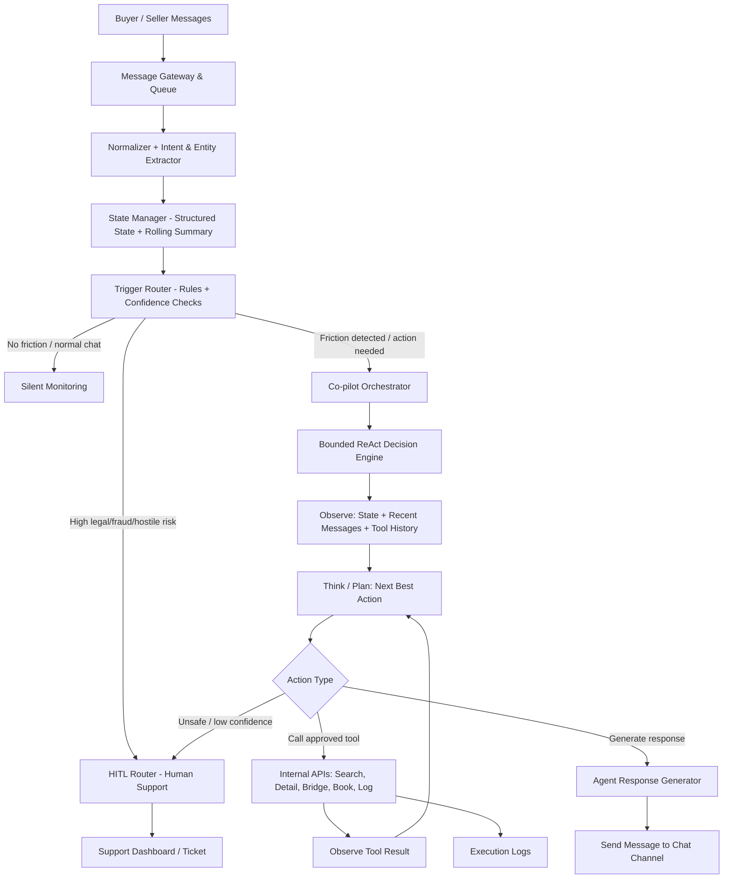

# AI Chat Agent for Motorbike Marketplace - Technical Assignment

## Detailed Concept & System Design

**Position:** AI Product Engineer | **Architecture Pattern:** State-Driven Hybrid Proxy & Co-pilot

---

## 0. Assignment Understanding & Delivery Scope

### 0.1. Chế độ deliverable được chọn

Deliverable này chọn hướng **detailed concept + system design**, có mô tả mocked tools và data flow rõ ràng thay vì xây full prototype. Lý do: đề bài đánh giá mạnh nhất ở **thinking process, state, memory, tools, failure modes, evaluation**, nên trong 3 ngày cần ưu tiên một thiết kế có thể implement được, audit được và iterate được.

### 0.2. Mapping yêu cầu đề bài vào README

| Yêu cầu trong assignment | README cover ở đâu | Ghi chú |
| :--- | :--- | :--- |
| Hiểu bài toán và mục tiêu | Section 1 | Định nghĩa vai trò Agent, North Star Metric và phạm vi c1/c2/c3. |
| State Schema JSON | Section 5 | Lưu constraints, listing context, risks, next best action, tool history, summary. |
| Memory Strategy | Section 6 | Phân biệt raw logs, structured memory, rolling summary và compaction. |
| Unstructured Data Handling | Section 7 | Normalize chat logs, extract intents/entities/risks, update state và log events. |
| Internal Tools / APIs | Section 8.1 | Mock schemas cho search, listing detail, bridge, booking, log event. |
| Agent Behavior | Section 8.2 | Router-first wake-up + bounded ReAct decision rules: hỏi thêm, search, bridge, booking, handoff. |
| Evaluation + Feedback Loop | Section 9 | Success definition, top metrics, offline eval, online feedback loop. |
| Error Analysis / Failure Modes | Section 5.3, 6.2, 7.4, 10 | Phân tích lỗi từ logs, worst-case và fallback. |

### 0.3. Phạm vi 3 ngày

**Trong scope 3 ngày:** README system design, state/tool schemas, sample extraction từ `chat_history.jsonl`, decision rules, failure modes, evaluation plan, và nếu có thời gian thì một mock script nhỏ để replay logs.

**Ngoài scope 3 ngày:** production chat UI, real payment/escrow/legal workflow, fraud model hoàn chỉnh, real-time infra, A/B testing thật, và integration với dữ liệu listing thật. Các phần này được nhắc như next iteration, không giả định đã xây xong.

### 0.4. Khung đánh giá quyết định

Mỗi lựa chọn thiết kế bên dưới được đánh giá theo 5 lens: **product risk**, **engineering complexity**, **cost/latency**, **trust & safety**, và **evaluator signal**. Mục tiêu không phải thiết kế hệ thống phức tạp nhất, mà là hệ thống đủ đơn giản để làm trong 3 ngày nhưng vẫn chứng minh được cách suy nghĩ về state, memory, tools và failure handling.

---

## 1. Executive Summary & Problem Framing

### 1.1. Bối cảnh Thị trường Xe máy cũ tại Việt Nam (Marketplace Dynamics)

Thương mại điện tử xe máy cũ là một thị trường có **độ ma sát giao dịch (transaction friction) cực kỳ lớn** do các đặc thù:

- **Bất đối xứng thông tin (Information Asymmetry):** Người mua lo ngại về chất lượng động cơ (đã rã máy chưa, ngập nước không), chỉ số ODO bị tua, và tình trạng pháp lý của xe (xe trộm cắp, xe tranh chấp, giấy tờ không chính chủ, không rút được hồ sơ gốc). Người bán lo ngại gặp phải "cò lái" ép giá hoặc những người hỏi chơi gây mất thời gian.
- **Ma sát thương lượng (Negotiation Friction):** Khoảng giá kỳ vọng (price gap) giữa người mua và người bán thường chênh lệch rất lớn. Không có một khung giá chuẩn hóa dẫn đến việc thương lượng dễ đi vào ngõ cụt.
- **Tỷ lệ rời bỏ cao (Drop-off Rate):** Giao dịch mua bán xe máy cũ cần sự phản hồi nhanh chóng và chính xác về thông tin kỹ thuật/thủ tục. Sự chậm trễ của con người (sellers/support) khiến lead dễ bị nguội và rời bỏ sàn.

### 1.2. Định nghĩa vai trò của AI Agent

AI Agent của chúng ta được thiết kế theo mô hình **Hybrid Proxy & Co-pilot**.

- **Nó không phải là một chatbot thông thường** cố gắng trả lời tự động mọi tin nhắn để thay thế con người.
- **Nó là một Transaction Facilitator (Kẻ thúc đẩy giao dịch):** Agent hoạt động ngầm (Silent Observer) để trích xuất dữ liệu phi cấu trúc, xây dựng State có cấu trúc, và chỉ can thiệp (Active Intervention) khi phát hiện các điểm nghẽn có thể giải quyết được bằng công cụ/quy trình để thúc đẩy giao dịch đi tiếp.
- **Mục tiêu tối thượng (North Star Metric):** **Tỷ lệ chốt lịch hẹn xem xe thành công (Appointment Booking Rate - ABR)**. Mọi cuộc trò chuyện trên Marketplace đối với tài sản giá trị cao cuối cùng đều phải dẫn đến việc gặp mặt trực tiếp để kiểm tra xe và giao dịch.

### 1.3. Phân tích Vấn đề & Lựa chọn Phạm vi Giải quyết (Problem & Scope Selection)

Trên sàn giao dịch xe máy cũ, người dùng thường gặp rất nhiều vấn đề cản trở giao dịch. Để tối ưu hóa nguồn lực phát triển trong vòng **3 ngày** và giải quyết đúng những gì nhà tuyển dụng quan tâm nhất ("What We Care About Most"), chúng tôi phân tích và lựa chọn phạm vi như sau:

#### Danh sách các vấn đề thường gặp (Problem Backlog):
1. **Bất đồng đàm phán giá:** Người mua trả giá quá thấp, người bán giữ giá quá cao, giao dịch đi vào ngõ cụt.
2. **Mập mờ pháp lý/giấy tờ:** Xe không chính chủ, đang rút hồ sơ gốc, giấy tờ viết tay, gây e ngại lớn về an toàn pháp lý.
3. **Người bán từ chối trung gian:** Người bán cá nhân không muốn làm việc với bên thứ ba (sàn/cò lái), muốn giao dịch trực tiếp.
4. **Spam & Lead kém chất lượng:** Người mua hỏi dạo không có ý định mua thật, gây mất thời gian của người bán.
5. **Chậm phản hồi (Latency):** Người bán phản hồi chậm trễ dẫn đến lead bị nguội và người mua bỏ sang sàn khác.
6. **Lừa đảo đặt cọc:** Kẻ xấu yêu cầu chuyển khoản đặt cọc trước rồi biến mất.

#### Lựa chọn Subset of Issues để giải quyết:
Chúng tôi chọn giải quyết **3 vấn đề cốt lõi** dưới đây làm mục tiêu chính cho AI Agent:
*   **c1: Xung đột đàm phán giá (Negotiation Gap)**
*   **c2: Rủi ro pháp lý và giấy tờ (Legal & Paperwork Risk)**
*   **c3: Người bán từ chối trung gian (Anti-Broker / Non-Intermediary Seller)**

#### Lý do lựa chọn (Selection Rationale):
Đây là **3 điểm nghẽn có đòn bẩy lớn nhất (highest leverage points)** ảnh hưởng trực tiếp đến tỷ lệ chuyển đổi cuối cùng (Appointment Booking Rate). 
- *Tại sao không chọn giải quyết vấn đề phản hồi chậm trước?* Vì đó là vấn đề thuần kỹ thuật hạ tầng (có thể giải quyết bằng push notification hoặc trigger cơ bản). 
- *Tại sao chọn c1, c2, c3?* Vì đây là các rào cản mang tính **tâm lý và niềm tin (Trust & Psychology)**. Nếu AI Agent đóng vai trò là bên thứ ba trung lập đứng ra hòa giải giá (c1), đảm bảo quy trình giao dịch an toàn (c2), và tạo cầu nối bảo mật thông tin (c3), chúng ta sẽ tháo gỡ được nỗi sợ lớn nhất của cả hai bên, thúc đẩy họ tiến tới bước gặp mặt trực tiếp.

---

## 2. Phân tích & Lựa chọn Phương thức Tương tác AI (AI Interaction Mode Analysis)

Để tích hợp AI vào cuộc hội thoại giữa Buyer và Seller, chúng tôi đặt ra 3 phương án thiết kế tương tác (Interaction Modes):

### 2.1. Các Phương án Đề xuất (Suggested Options)

*   **Option A: Full Auto-Agent (Active Chatbot):** AI đóng vai trò đại diện thế thân cho một bên (thường là Seller) để tự động trả lời 100% tin nhắn của đối phương và dẫn dắt cuộc trò chuyện đến khi chốt lịch.
*   **Option B: Seller Co-pilot (Draft Suggestions):** AI chạy ẩn và chỉ đưa ra các gợi ý câu trả lời dưới dạng nút bấm (suggestion chips) hoặc bản nháp (drafts) trong màn hình của Seller. Seller quyết định chỉnh sửa và nhấn gửi.
*   **Option C: Hybrid Proxy & Co-pilot (Silent Monitor + Active Trigger - Lựa chọn đề xuất):** AI hoạt động như một "trọng tài ngầm" (Silent Observer) trong phòng chat. Nó không can thiệp vào cuộc chat thông thường của hai bên. Chỉ khi phát hiện các "friction triggers" cụ thể (như c1, c2, c3), Agent mới chủ động can thiệp (gửi tin nhắn hỗ trợ công khai hoặc kích hoạt công cụ kết nối).

### 2.2. Ma trận So sánh & Đánh giá Trade-offs (Trade-offs Matrix)

| Tiêu chí đánh giá | Option A: Full Auto-Agent | Option B: Seller Co-pilot | Option C: Hybrid Proxy & Co-pilot |
| :--- | :--- | :--- | :--- |
| **UX Pros (Ưu điểm UX)** | Phản hồi tức thì 24/7. Giải phóng hoàn toàn sức lao động cho người bán. | Con người kiểm soát hoàn toàn thông tin. Câu từ tự nhiên, mang tính cá nhân cao. | **Tự nhiên và khách quan.** Người dùng không bị cảm giác "nói chuyện với bot". AI chỉ xuất hiện như một dịch vụ hỗ trợ của sàn khi cần. |
| **UX Cons (Nhược điểm UX)** | Người dùng dễ cảm thấy bị "lừa dối" hoặc khó chịu khi nhận ra đang chat với bot tự động về tài sản giá trị lớn. | Tốc độ phản hồi vẫn bị phụ thuộc hoàn toàn vào thời gian online và thao tác của Seller. | Cần cơ chế thiết kế UI/UX tinh tế để việc AI nhảy vào can thiệp không gây cảm giác bị xâm phạm quyền riêng tư. |
| **Failure Consequences (Hệ quả khi lỗi)** | **Rất nghiêm trọng.** Nếu AI ảo tưởng (hallucinate) tự hứa giảm giá xe hoặc cam kết giấy tờ giả, sàn sẽ gặp khủng hoảng uy tín hoặc pháp lý. | Rất nhẹ. Seller sẽ tự lọc bỏ những câu trả lời sai lệch trước khi nhấn gửi. | **Trung bình.** Nếu trigger nhầm, Agent có thể gửi tin nhắn không liên quan. Có thể khắc phục bằng nút "Tắt hỗ trợ AI" cho người dùng. |
| **Implementation Complexity** | Trung bình. Đòi hỏi prompt tốt để duy trì hội thoại dài. | Thấp. Chỉ là UI widget hiển thị gợi ý câu trả lời. | **Cao.** Cần hệ thống Event-driven Trigger, real-time message stream parsing và quản lý chuyển đổi trạng thái (state transition). |
| **Operational Costs (Chi phí)** | Cao. LLM phải chạy liên tục cho mọi tin nhắn phát sinh trong cuộc hội thoại. | Trung bình. Chỉ chạy khi Seller mở app và có tin nhắn mới. | **Tối ưu nhất.** Sử dụng mô hình NLP siêu nhỏ/rẻ tiền để quét trigger. Chỉ gọi LLM Agent đắt tiền khi thực sự cần can thiệp. |
| **Delay / Latency (Độ trễ)** | Rất thấp (1-2s phản hồi tự động). | Cao (phụ thuộc vào con người duyệt). | **Không đáng kể** đối với cuộc chat thường (peer-to-peer). Chỉ trễ ~2s khi Agent kích hoạt can thiệp. |
| **Context Appropriateness** | Thấp. Không phù hợp với tài sản giá trị cao (xe máy cũ) cần lòng tin tuyệt đối ở Việt Nam. | Khá phù hợp nhưng không giải quyết triệt để vấn đề drop-off. | **Cực kỳ phù hợp.** Sàn đóng vai trò trung gian bảo trợ giao dịch an toàn và minh bạch. |

### 2.3. Lựa chọn Cuối cùng & Lý giải (Final Decision & Rationale)

Chúng tôi lựa chọn **Option C: Hybrid Proxy & Co-pilot**.

*Lý do:* Mua bán xe máy cũ tại Việt Nam là giao dịch có độ rủi ro và giá trị cao. Việc sử dụng chatbot tự động (Option A) dễ gây mất lòng tin và dẫn đến tỷ lệ rời bỏ sàn tăng. Option B thì quá thụ động và không giải quyết được các thời điểm cần can thiệp nhanh. **Option C là phương án cân bằng hơn**: Nó tôn trọng quyền thương lượng trực tiếp của hai bên, đồng thời xuất hiện đúng lúc với tư cách là **sàn giao dịch bảo trợ** để giải quyết các nút thắt pháp lý, bảo mật và đàm phán giá.

*Fallback nếu Option C gây khó chịu:* Cho phép tắt AI trên từng lead, chuyển sang chế độ quan sát im lặng, và tạo ticket handoff cho CSKH. Điều này giới hạn thiệt hại UX khi Agent trigger sai hoặc người dùng không muốn có bên thứ ba trong cuộc trò chuyện.

---

## 3. Phân tích Tối ưu hóa Thiết kế Hệ thống: RAG vs. Agent vs. Cost

Để xây dựng hệ thống theo Option C, chúng tôi phân tích 3 hướng kiến trúc kỹ thuật dưới đây:

### 3.1. Các Phương án Kiến trúc (Architecture Options)

*   **Option A: Pure RAG / Q&A Architecture:** Hệ thống sử dụng Vector Database chứa chính sách sàn và thông tin xe. Khi người dùng hỏi, LLM sẽ truy vấn DB và trả lời trực tiếp.
*   **Option B: Pure Agentic ReAct Loop:** Mỗi tin nhắn đến từ người dùng được đẩy vào một Agent chạy vòng lặp ReAct (Reasoning -> Action -> Observation). Agent tự suy luận để quyết định khi nào dùng tool và khi nào trả lời.
*   **Option C: State-Driven Router + Bounded ReAct Decision Engine (Lựa chọn đề xuất):** Tách biệt quy trình xử lý thành hai tầng. Một Small LLM/NLP model chạy ngầm để trích xuất thực thể và cập nhật State DB. Sau đó, Trigger Router đọc State để quyết định **khi nào** cần can thiệp. Nếu cần can thiệp, Co-pilot Orchestrator gọi một bounded ReAct Decision Engine để observe state, lập action plan, gọi tool hợp lệ hoặc tạo phản hồi.

### 3.2. Ma trận So sánh Kỹ thuật (Technical Comparison)

| Tiêu chí | Option A: Pure RAG | Option B: Pure ReAct Agent | Option C: State Router + Bounded ReAct |
| :--- | :--- | :--- | :--- |
| **Predictability & Guardrails** | **Rất cao.** Phản hồi hoàn toàn nằm trong phạm vi tài liệu RAG cung cấp. | **Rất thấp.** Agent dễ bị lặp vô hạn (infinite loop) hoặc tự ý gọi tool sai ngữ cảnh. | **Cao.** Router kiểm soát khi nào Agent chạy; bounded ReAct chỉ được dùng approved actions/tools. |
| **Latency (Độ trễ)** | Rất thấp (~1s). | Rất cao (3-8s vì phải chạy nhiều bước suy luận qua API LLM). | **Thấp đến trung bình.** Tin nhắn thường đi trực tiếp; khi có trigger, bounded ReAct chạy 1-3 bước có kiểm soát. |
| **Token Cost (Chi phí)** | Thấp và ổn định. | Rất cao và tăng dần theo độ dài lịch sử chat (quadratic cost growth). | **Tối ưu hơn Pure ReAct.** Model nhỏ parse mọi tin nhắn; LLM lớn chỉ chạy khi Router wake agent. |
| **Capability (Khả năng)** | Kém. Chỉ Q&A, không thể chủ động gọi các logic nghiệp vụ phức tạp. | Rất tốt. Có khả năng tự xử lý linh hoạt mọi tình huống mới phát sinh. | **Cao.** Vừa có state/rules để kiểm soát, vừa có ReAct loop ngắn để xử lý tình huống cần reasoning/tool chaining. |
| **Failure Modes (Kịch bản lỗi)** | Trả lời sai thông tin xe hoặc chính sách pháp lý nếu thông tin trong DB lỗi thời. | Lặp vô hạn, tiêu tốn token cực lớn, gọi sai công cụ ảnh hưởng tới database người dùng. | Trigger sai, extract sai, hoặc bounded ReAct chọn action chưa phù hợp nếu guardrail/confidence yếu. |

### 3.3. Quyết định Kiến trúc & Lý giải (Architectural Decision)

Chúng tôi chọn **Option C: State-Driven Router + Bounded ReAct Decision Engine**.

*Lý do:* Đối với một sản phẩm thương mại thực tế, **sự ổn định (Predictability)** và **chi phí vận hành (Cost)** là hai yếu tố sống còn. Việc để một Agent tự do chạy ReAct Loop cho mọi tin nhắn là quá mạo hiểm và tốn kém. Tuy nhiên, khi đã có trigger rõ ràng, bounded ReAct lại phù hợp vì Decision Engine có thể **observe** structured state, recent messages và tool history; **think/plan** next best action; rồi **act** bằng approved tool hoặc phản hồi phù hợp. Router sở hữu quyết định **khi nào wake agent**, còn bounded ReAct sở hữu quyết định **giải quyết case đã được wake như thế nào**.

*Fallback nếu kiến trúc này sai:* Mọi update nhạy cảm cần `confidence` đủ cao, qua validation rule, và luôn lưu `source_message_ids` để replay lại raw logs. Nếu state mâu thuẫn hoặc bounded ReAct không đủ tự tin, hệ thống không gọi tool có tác động lớn mà chuyển sang `ASK_CLARIFYING_QUESTION` hoặc `ESCALATE_TO_SUPPORT`.

---

## 4. System Architecture & Information Flow

Hệ thống sử dụng mô hình **State-Driven Hybrid Proxy & Co-pilot Architecture**. Thay vì chạy ReAct Loop không giới hạn cho mỗi tin nhắn đến, hệ thống dùng một pipeline phân tầng: extractor cập nhật state, router quyết định có cần wake Agent hay không, và khi cần can thiệp thì Co-pilot Orchestrator chạy một **bounded ReAct Decision Engine**.



### Quy trình luồng thông tin (Information Flow)

1.  **Ingestion:** Buyer và Seller gửi tin nhắn vào kênh chat chung.
2.  **Silent Extraction:** Một model LLM nhỏ, chi phí thấp (ví dụ: `GPT-4o-mini` hoặc `Llama-3-8B-Instruct` được lượng tử hóa) phân tích tin nhắn để trích xuất thực thể (NER) như: hãng xe, khoảng giá, địa điểm, odo, các rủi ro giấy tờ và cập nhật vào **State Database**.
3.  **Trigger Router:** Một bộ lọc deterministic + confidence checks dựa trên State vừa cập nhật để quyết định:
    *   _Trường hợp 1 (Silent):_ Cuộc đối thoại đang diễn ra bình thường giữa hai bên. Agent im lặng để tránh làm loãng chat và tiết kiệm chi phí.
    *   _Trường hợp 2 (Active Intervention):_ Xuất hiện các sự kiện cần xử lý (ví dụ: người mua hỏi xe tương tự, hai bên đồng ý xem xe nhưng chưa chốt giờ, phát hiện rủi ro giấy tờ). Router wake bounded ReAct Decision Engine để observe context, lập plan, gọi tool hoặc sinh phản hồi.
    *   _Trường hợp 3 (Escalation):_ Người dùng bày tỏ sự bực tức, từ chối Agent (`c3`), hoặc rủi ro pháp lý quá phức tạp. Chuyển ngay lập tức sang người thật (Human-in-the-loop).
4.  **Bounded ReAct Decision Engine:** Khi được wake, Decision Engine chạy chu trình ngắn `Observe -> Think/Plan -> Act -> Observe result -> Reply/Log`, tối đa vài bước và chỉ với approved tools.

---

## 5. State Schema Design (JSON Schema)

Chúng tôi thiết kế một State Schema động, lưu trữ trạng thái của cuộc hội thoại/lead. Trạng thái này là **Single Source of Truth** được đưa vào context của Agent thay vì gửi toàn bộ lịch sử chat thô.

### 5.1. State Schema JSON

```json
{
    "$schema": "http://json-schema.org/draft-07/schema#",
    "title": "ConversationState",
    "type": "object",
    "properties": {
        "conversation_id": { "type": "string" },
        "last_updated_at": { "type": "string", "format": "date-time" },
        "state_confidence": { "type": "number", "minimum": 0, "maximum": 1 },
        "participants": {
            "type": "object",
            "properties": {
                "buyer_id": { "type": "string" },
                "seller_id": { "type": "string" }
            },
            "required": ["buyer_id", "seller_id"]
        },
        "lead_stage": {
            "type": "string",
            "enum": [
                "DISCOVERY",
                "MATCHING",
                "NEGOTIATION",
                "APPOINTMENT",
                "CLOSING",
                "DROPPED",
                "ESCALATED"
            ]
        },
        "constraints": {
            "type": "object",
            "description": "Buyer constraints and hard preferences extracted from chat. This replaces the narrower buyer_preferences naming.",
            "properties": {
                "budget_limit": { "type": ["number", "null"] },
                "locations": { "type": "array", "items": { "type": "string" } },
                "preferred_brands": {
                    "type": "array",
                    "items": { "type": "string" }
                },
                "preferred_models": {
                    "type": "array",
                    "items": { "type": "string" }
                },
                "year_range": {
                    "type": "object",
                    "properties": {
                        "min": { "type": ["integer", "null"] },
                        "max": { "type": ["integer", "null"] }
                    }
                },
                "odo_preference": { "type": ["string", "null"] },
                "deal_breakers": {
                    "type": "array",
                    "items": { "type": "string" }
                }
            }
        },
        "listing_context": {
            "type": "object",
            "properties": {
                "selected_listing_ids": {
                    "type": "array",
                    "items": { "type": "string" }
                },
                "candidate_listing_ids": {
                    "type": "array",
                    "items": { "type": "string" }
                },
                "active_listing": {
                    "type": "object",
                    "properties": {
                        "listing_id": { "type": ["string", "null"] },
                        "brand": { "type": ["string", "null"] },
                        "model": { "type": ["string", "null"] },
                        "year": { "type": ["integer", "null"] },
                        "odo": { "type": ["number", "null"] },
                        "asking_price": { "type": ["number", "null"] },
                        "paperwork_status": { "type": ["string", "null"] }
                    }
                }
            }
        },
        "negotiation_state": {
            "type": "object",
            "properties": {
                "buyer_last_offer": { "type": ["number", "null"] },
                "seller_last_offer": { "type": ["number", "null"] },
                "price_gap_percentage": { "type": ["number", "null"] },
                "counter_offer_suggestions": {
                    "type": "array",
                    "items": { "type": "number" }
                }
            }
        },
        "risks": {
            "type": "array",
            "items": {
                "type": "object",
                "properties": {
                    "risk_type": {
                        "type": "string",
                        "enum": [
                            "LEGAL_PAPERWORK",
                            "PAPERWORK_PENDING",
                            "HIGH_ODO",
                            "PRICE_GAP_TOO_HIGH",
                            "ANTI_BROKER_SELLER",
                            "SUSPICIOUS_BEHAVIOR",
                            "POSSIBLE_SCAM",
                            "PII_LEAKAGE"
                        ]
                    },
                    "description": { "type": "string" },
                    "detected_at": { "type": "string", "format": "date-time" },
                    "confidence": { "type": "number", "minimum": 0, "maximum": 1 },
                    "source_message_ids": {
                        "type": "array",
                        "items": { "type": "string" }
                    }
                },
                "required": ["risk_type", "description", "detected_at"]
            }
        },
        "open_questions": {
            "type": "array",
            "description": "Những thông tin còn thiếu cần Agent chủ động khai thác thêm",
            "items": { "type": "string" }
        },
        "next_best_action": {
            "type": "object",
            "properties": {
                "action_type": {
                    "type": "string",
                    "enum": [
                        "ASK_CLARIFYING_QUESTION",
                        "SEARCH_SIMILAR_LISTINGS",
                        "GET_LISTING_DETAIL",
                        "INITIATE_NEGOTIATION_BRIDGE",
                        "PROPOSE_APPOINTMENT",
                        "ESCALATE_TO_SUPPORT"
                    ]
                },
                "reasoning": { "type": "string" },
                "tool_name": { "type": ["string", "null"] },
                "confidence": { "type": "number", "minimum": 0, "maximum": 1 },
                "source_message_ids": {
                    "type": "array",
                    "items": { "type": "string" }
                }
            },
            "required": ["action_type", "reasoning"]
        },
        "tool_history": {
            "type": "array",
            "items": {
                "type": "object",
                "properties": {
                    "tool_name": { "type": "string" },
                    "timestamp": { "type": "string", "format": "date-time" },
                    "success": { "type": "boolean" },
                    "input_summary": { "type": "string" },
                    "result_summary": { "type": "string" }
                }
            }
        },
        "handoff_reason": { "type": ["string", "null"] },
        "outcome": {
            "type": ["string", "null"],
            "enum": ["SUCCESS", "DROPPED", "ESCALATED", "UNKNOWN", null]
        },
        "conversation_summary": { "type": "string" }
    },
    "required": [
        "conversation_id",
        "participants",
        "lead_stage",
        "constraints",
        "listing_context",
        "negotiation_state",
        "risks",
        "open_questions",
        "next_best_action",
        "conversation_summary"
    ]
}
```

### 5.2. Rationale & Trade-offs (Tại sao chọn cấu trúc này?)

-   **Tại sao lưu trữ State thay vì gửi toàn bộ raw chat history?**
    -   _Tiết kiệm chi phí (Cost reduction):_ Gửi toàn bộ tin nhắn thô vào LLM qua mỗi turn chat sẽ làm chi phí token tăng theo cấp số nhân. Bằng cách lưu State, chúng ta chỉ gửi khoảng ~500 tokens mô tả bản chất thông tin và 3 tin nhắn gần nhất làm ngữ cảnh văn phong.
    -   _Tính nhất quán (State Consistency):_ LLM có xu hướng "quên" hoặc "suy diễn sai" nếu phải tự đọc lại một đoạn chat dài hỗn độn của 2 bên. Việc cấu trúc hóa State giúp Agent luôn nắm giữ "sự thật duy nhất" đã được xác thực.
    -   _Deterministic Logic:_ Lập trình viên có thể viết code logic rõ ràng bao ngoài LLM (Ví dụ: `if price_gap_percentage > 25% then trigger ESCALATE_TO_SUPPORT` thay vì phụ thuộc hoàn toàn vào quyết định cảm tính của LLM).
-   **Cái gì được lưu (Stored) vs. Không được lưu (Not Stored) trong State?**
    -   _Được lưu:_ Các dữ liệu lọc cứng trong `constraints` (budget, location, hãng xe), listing đang xét, rủi ro pháp lý đã xác nhận, mức giá chào bán/mua gần nhất, stage hiện tại của phễu bán hàng, nguồn tin nhắn và confidence cho các update nhạy cảm.
    -   _Không được lưu:_ Các lời chào hỏi xã giao, các câu nói đùa, cảm xúc tức thời của người dùng, hoặc các chi tiết vụn vặt không đóng góp vào bộ lọc xe và quy trình đặt lịch.

### 5.3. Failure Modes & Fallback Solutions của State Schema

*   **Failure Mode (Kịch bản lỗi):** LLM trích xuất sai giá trị số (Ví dụ: Người mua nhắn "bớt 2 triệu đi anh" cho chiếc xe 30 triệu, LLM trích xuất nhầm `buyer_last_offer = 2.000.000 VNĐ` thay vì `28.000.000 VNĐ`).
*   **Worst-Case Scenario (Kịch bản xấu nhất):** Hệ thống tính toán `price_gap_percentage = 93%` và tự động đánh giá giao dịch thất bại, chuyển trạng thái sang `DROPPED` hoặc gửi cảnh báo lỗi đàm phán nghiêm trọng lên hệ thống, làm gián đoạn cuộc chat của khách hàng một cách vô lý.
*   **Fallback Solution (Giải pháp dự phòng):**
    1.  **Range Validation Rule (Quy tắc giới hạn cứng):** Thiết lập một lớp validate bằng code cứng: Mọi giá trị đàm phán đề xuất của người mua (`buyer_last_offer`) buộc phải nằm trong khoảng từ `40%` đến `120%` giá niêm yết của xe (`listing_context.active_listing.asking_price`). Nếu giá trị trích xuất nằm ngoài khoảng này, hệ thống sẽ bỏ qua cập nhật trường đó và ghi nhận sự kiện `STATE_EXTRACTION_LOW_CONFIDENCE`.
    2.  **Explicit Confirmation (Xác nhận tường minh):** Khi Agent muốn thực hiện hành động dựa trên State nhạy cảm (ví dụ đề xuất chốt giá), Agent sẽ hiển thị kèm nút bấm xác nhận trên giao diện chat (Ví dụ: "Bạn muốn đề xuất mức giá 28 triệu đúng không? [Đồng ý] [Nhập lại]").

---

## 6. Memory Strategy (Chiến lược bộ nhớ)

Hệ thống quản lý bộ nhớ thông qua chiến lược **3-Tier Memory Architecture** nhằm đảm bảo sự cân bằng giữa bối cảnh (context), độ chính xác (accuracy) và chi phí (cost).

| Tầng bộ nhớ | Dữ liệu lưu trữ | Vị trí lưu trữ | Cách thức truy xuất | Mục đích sử dụng |
| :--- | :--- | :--- | :--- | :--- |
| **Tier 1: Raw Transaction Logs** | Lịch sử chat thô đầy đủ của tất cả các bên (buyer, seller, agent). | Cold Storage (PostgreSQL Logs / MongoDB) | Không đưa trực tiếp vào prompt của Agent. Chỉ load khi cần tái cấu trúc hoặc debug. | Đánh giá offline, chạy Eval, kiểm toán và huấn luyện lại mô hình (Fine-tuning). |
| **Tier 2: Structured State (Semantic Memory)** | State Schema động (Constraints, Listings, Risks, Negotiation, Stage). | RAM Cache (Redis) + Main DB | Được serialize thành chuỗi JSON/Markdown và chèn trực tiếp vào System Prompt của Agent mỗi turn. | Làm bối cảnh đưa ra quyết định gọi Tool và định hướng hội thoại cho Agent. |
| **Tier 3: Rolling Summary** | Tóm tắt ngắn gọn diễn biến cuộc hội thoại được cập nhật lũy tiến sau mỗi 5-10 tin nhắn. | Redis Cache | Chèn vào cuối system prompt làm bối cảnh sắc thái hội thoại ngắn hạn. | Giúp Agent nắm được tone giọng, tâm trạng của khách hàng và các thảo luận ngắn hạn chưa cấu trúc hóa. |

### Cơ chế dọn dẹp và nén bộ nhớ (Compaction & Pruning)

Khi hội thoại kéo dài (turn chat > 15), hệ thống kích hoạt **Compaction Job** chạy ngầm (asynchronous):
1.  LLM phụ trách nén (Compressor LLM) đọc: `State hiện tại` + `Lịch sử chat 10 turn gần nhất` + `Rolling Summary cũ`.
2.  Mô hình tạo ra `Rolling Summary mới` (giới hạn tối đa 150 từ), cập nhật các trường thông tin bị thiếu trong `Structured State` và xóa bớt lịch sử chat thô trong bộ nhớ đệm tạm thời (chỉ giữ lại 3 tin nhắn gần nhất để làm mượt văn phong phản hồi).

### 6.2. Failure Modes & Fallback Solutions của Memory Strategy

*   **Failure Mode:** Tiến trình Compaction bằng LLM vô tình làm mất thông tin "deal-breaker" cực kỳ quan trọng của Buyer (Ví dụ: Buyer từng nhấn mạnh "Xe phải chưa rã máy, nếu rã rồi thì mình không mua").
*   **Worst-Case Scenario:** Agent sau khi nén bộ nhớ đã quên mất yêu cầu này, tiếp tục gợi ý một chiếc xe khác của sàn đã từng làm lại máy, khiến Buyer cảm thấy sàn thiếu chuyên nghiệp, lừa dối và rời bỏ nền tảng ngay lập tức.
*   **Fallback Solution:**
    1.  **Immutable State Flags:** Thiết lập một số trường thông tin trong State Schema là "bất biến" (Immutable) một khi đã được xác thực (như `deal_breakers`, `budget_limit`). Tiến trình Compaction chỉ được phép thêm mới thông tin, tuyệt đối không được ghi đè hoặc xóa các trường này trừ khi có hành động chỉnh sửa trực tiếp từ người dùng.
    2.  **Raw Keyword Search Validator:** Trước khi Agent đưa ra đề xuất xe hoặc chốt lịch, hệ thống sẽ thực hiện một cú quét nhanh (regex/keyword search) trên Raw Transaction Logs (Tier 1) để tìm kiếm các từ khóa nhạy cảm liên quan đến các thỏa thuận trước đó nhằm double-check tính chính xác.

---

## 7. Unstructured Data Handling & Risk Detection

Đối với file raw logs như `chat_history.jsonl`, hệ thống thực hiện pipeline xử lý dữ liệu phi cấu trúc theo các bước:

```
Raw Message -> Normalizer -> Small LLM Extraction -> Schema Validation -> State Update & Event Log
```

### 7.1. Normalization

-   Xử lý tiếng lóng và viết tắt địa phương (Ví dụ: `ko` -> `không`, `hcm` -> `Hồ Chí Minh`, `ab` -> `Air Blade`, `25tr` -> `25.000.000 VNĐ`, `odo thấp` -> yêu cầu số km thấp, `rút hồ sơ gốc` -> giấy tờ chưa hoàn tất, `không qua trung gian` -> reject intermediary).
-   Chuẩn hóa định dạng thời gian và gán vai trò người gửi (`buyer`, `seller`, `agent`).

### 7.2. Trích xuất thông tin (Extraction) bằng Small LLM

Sử dụng prompt với cấu trúc Output format là JSON để trích xuất các trường:
-   `intents`: `SEARCH_BIKE`, `NEGOTIATE_PRICE`, `ASK_PAPERWORK`, `BOOK_APPOINTMENT`, `REJECT_INTERMEDIARY`.
-   `entities`: Hãng xe, dòng xe, mức giá, đời xe, ODO, địa chỉ.
-   `risk_signals`:
    *   _Rủi ro pháp lý:_ Giấy tờ chưa sang tên được, đang rút hồ sơ gốc (`c2`).
    *   _Rủi ro xung đột:_ Người bán ghét trung gian/môi giới (`c3`).
    *   _Rủi ro giao dịch:_ Người mua ép giá quá sâu hoặc người bán từ chối giảm giá thương lượng (`c1`).

### 7.3. Sample Extraction từ `chat_history.jsonl`

| Conversation | Normalized facts | Detected intent | State updates | Risk signal | Next best action | Logged events |
| :--- | :--- | :--- | :--- | :--- | :--- | :--- |
| `c1` | Budget 25-26M, HCM, Honda/Yamaha, year >= 2020, low ODO; seller has Air Blade 2021, ODO 19k, ask 32M. | `SEARCH_BIKE`, `NEGOTIATE_PRICE` | `constraints.budget_limit = 26000000`, `listing_context.active_listing.asking_price = 32000000`, `negotiation_state.price_gap_percentage ~= 0.23` | `PRICE_GAP_TOO_HIGH` | `SEARCH_SIMILAR_LISTINGS` hoặc đề xuất midpoint nếu cả hai còn thiện chí. | `USER_MESSAGE`, `STATE_UPDATE`, `AGENT_ACTION`, `TOOL_CALL` |
| `c2` | Buyer hỏi giấy tờ Vision; seller nói đang chờ rút hồ sơ gốc, chưa sang tên ngay. | `ASK_PAPERWORK` | `risks += PAPERWORK_PENDING`, `open_questions += ["Khi nào rút xong hồ sơ gốc?", "Sàn có bảo chứng thủ tục không?"]` | `LEGAL_PAPERWORK` | `ESCALATE_TO_SUPPORT` nếu thiếu chính sách bảo vệ; nếu có chính sách, Agent giải thích an toàn trước. | `USER_MESSAGE`, `STATE_UPDATE`, `ESCALATION` |
| `c3` | Buyer muốn xem xe; seller không muốn trung gian/môi giới và yêu cầu số điện thoại buyer. | `BOOK_APPOINTMENT`, `REJECT_INTERMEDIARY` | `risks += ANTI_BROKER_SELLER`, `risks += PII_LEAKAGE`, `lead_stage = ESCALATED` nếu seller tiếp tục ép lấy PII. | `ANTI_BROKER_SELLER`, `PII_LEAKAGE` | `INITIATE_NEGOTIATION_BRIDGE` với privacy proxy hoặc `ESCALATE_TO_SUPPORT`. | `USER_MESSAGE`, `STATE_UPDATE`, `HANDOFF`, `AGENT_ACTION` |

Ví dụ event logs tối thiểu:

```json
{
    "conversation_id": "c1",
    "event": {
        "event_type": "STATE_UPDATE",
        "timestamp": "2026-02-05T09:03:05Z",
        "payload": {
            "source_message_ids": ["c1:2026-02-05T09:03:05Z"],
            "updated_fields": {
                "constraints.budget_limit": 26000000,
                "negotiation_state.buyer_last_offer": 26000000
            },
            "confidence": 0.92
        }
    }
}
```

```json
{
    "conversation_id": "c2",
    "event": {
        "event_type": "AGENT_ACTION",
        "timestamp": "2026-02-06T10:11:20Z",
        "payload": {
            "action_type": "ESCALATE_TO_SUPPORT",
            "reason": "Paperwork pending and buyer is worried about legal risk",
            "risk_type": "PAPERWORK_PENDING"
        }
    }
}
```

### 7.4. Failure Modes & Fallback Solutions của Unstructured Extraction

*   **Failure Mode:** Hiểu sai từ lóng chuyên ngành xe máy của Việt Nam (Ví dụ: Seller nhắn "xe cọp nha em" - tức là xe chất lượng cực kỳ tốt/như mới. LLM dịch nghĩa đen hoặc tưởng xe có vấn đề nguy hiểm).
*   **Worst-Case Scenario:** Agent ghi nhận nhầm đây là `risk_type = "SUSPICIOUS_BEHAVIOR"` (hành vi khả nghi/lừa đảo), tự động khóa tài khoản của người bán hoặc kích hoạt cấm giao dịch, làm mất oan một người bán uy tín và gây trải nghiệm tồi tệ.
*   **Fallback Solution:**
    1.  **Slang Pre-processing Dictionary:** Xây dựng một từ điển ánh xạ (Deterministic Mapping Dictionary) chạy trước LLM để chuẩn hóa từ lóng: `xe cọp` -> `xe rất mới`, `giấy sàn` -> `giấy tờ giả/rủi ro cao`, `xe cày` -> `xe đi nhiều/odo cao`, `nồi đồng cối đá` -> `rất bền`.
    2.  **Risk Confidence Threshold:** Hệ thống chỉ cập nhật Risk vào State nếu Small LLM trả về độ tin cậy (Confidence Score) > 85%. Dưới mức đó, hệ thống sẽ đẩy tin nhắn vào hàng đợi duyệt nhanh (Human-in-the-loop review queue) để nhân viên CSKH bấm nút phê duyệt trong vòng 2 phút.

---

## 8. Agent Behavior & Decision Logic

Agent hoạt động theo hướng **router-first, bounded ReAct after trigger**. Nghĩa là hệ thống không để LLM tự do quyết định mọi thứ cho mọi tin nhắn; router đọc State trước để xác định có cần wake Agent hay không. Khi được wake, bounded ReAct Decision Engine có thể observe context, lập action plan, gọi approved tools, quan sát kết quả tool, rồi phản hồi hoặc handoff trong phạm vi guardrails.

### 8.1. Chi tiết các công cụ (Tool Specifications)

Chúng tôi định nghĩa các tools dưới dạng JSON Schema để bounded ReAct Agent có thể gọi chính xác. Tool calls không hardcode hoàn toàn: **router/state/rules quyết định eligibility**, còn bounded ReAct quyết định **action plan và tham số cụ thể** trong phạm vi allowed tools, schema validation và confidence thresholds.

#### 1. `search_listings`
```json
{
    "name": "search_listings",
    "description": "Tìm kiếm các xe máy đang được đăng bán trên sàn phù hợp với bộ lọc.",
    "parameters": {
        "type": "object",
        "properties": {
            "brand": { "type": "string", "description": "Hãng xe ví dụ: Honda, Yamaha" },
            "model": { "type": "string", "description": "Dòng xe ví dụ: Vision, Air Blade, Grande" },
            "year_range": {
                "type": "object",
                "properties": {
                    "min": { "type": "integer" },
                    "max": { "type": "integer" }
                }
            },
            "price_range": {
                "type": "object",
                "properties": {
                    "min": { "type": "number" },
                    "max": { "type": "number" }
                }
            },
            "location": { "type": "string", "description": "Thành phố ví dụ: HCM, Hà Nội" },
            "keywords": {
                "type": "array",
                "items": { "type": "string" },
                "description": "Từ khóa mềm như odo thấp, xe zin, chính chủ"
            }
        }
    }
}
```

#### 2. `get_listing_detail`
```json
{
    "name": "get_listing_detail",
    "description": "Lấy thông tin chi tiết của một listing trước khi Agent tư vấn hoặc book lịch.",
    "parameters": {
        "type": "object",
        "properties": {
            "listing_id": { "type": "string" }
        },
        "required": ["listing_id"]
    }
}
```

#### 3. `create_chat_bridge`
```json
{
    "name": "create_chat_bridge",
    "description": "Kết nối trực tiếp kênh trò chuyện riêng giữa Buyer và Seller khi họ sẵn sàng giao dịch.",
    "parameters": {
        "type": "object",
        "properties": {
            "buyer_id": { "type": "string" },
            "seller_id": { "type": "string" },
            "listing_id": { "type": "string" }
        },
        "required": ["buyer_id", "seller_id", "listing_id"]
    }
}
```

#### 4. `book_appointment`
```json
{
    "name": "book_appointment",
    "description": "Đặt lịch hẹn xem xe trực tiếp giữa người mua và người bán.",
    "parameters": {
        "type": "object",
        "properties": {
            "channel_id": { "type": "string" },
            "time": { "type": "string", "description": "Thời gian hẹn dưới định dạng ISO 8601 hoặc chuỗi mô tả cụ thể" },
            "place": { "type": "string", "description": "Địa điểm hẹn gặp xem xe" }
        },
        "required": ["channel_id", "time", "place"]
    }
}
```

#### 5. `log_event`
```json
{
    "name": "log_event",
    "description": "Ghi lại sự kiện, quyết định, tool call, state update và outcome để audit và training data.",
    "parameters": {
        "type": "object",
        "properties": {
            "conversation_id": { "type": "string" },
            "event": {
                "type": "object",
                "properties": {
                    "event_type": {
                        "type": "string",
                        "enum": [
                            "USER_MESSAGE",
                            "AGENT_ACTION",
                            "TOOL_CALL",
                            "TOOL_RESULT",
                            "STATE_UPDATE",
                            "ESCALATION",
                            "HANDOFF",
                            "FEEDBACK"
                        ]
                    },
                    "payload": { "type": "object" },
                    "timestamp": { "type": "string", "format": "date-time" }
                },
                "required": ["event_type", "payload", "timestamp"]
            }
        },
        "required": ["conversation_id", "event"]
    }
}
```

#### Khi nào Agent gọi từng tool?

| Tool | Khi nào gọi | Guardrail chính |
| :--- | :--- | :--- |
| `search_listings` | Buyer có constraints đủ rõ hoặc giá hiện tại vượt budget. | Không bịa listing; chỉ trả xe từ tool result. |
| `get_listing_detail` | Có listing cụ thể trước khi tư vấn chi tiết, rủi ro, hoặc book lịch. | Nếu thiếu detail quan trọng thì hỏi thêm hoặc handoff. |
| `create_chat_bridge` | Hai bên sẵn sàng trao đổi trực tiếp hoặc seller không muốn qua trung gian nhưng buyer vẫn muốn xem xe. | Bảo vệ PII, không ép giao dịch ngoài sàn. |
| `book_appointment` | Đã có channel, thời gian, địa điểm và listing đủ rõ. | Không book nếu có legal/fraud risk chưa xử lý. |
| `log_event` | Mọi message, state update, tool call/result, handoff, feedback. | Payload đủ source để audit và replay. |

### 8.2. Logic ra quyết định & Quy tắc chuyển giao (Escalation / Handoff)

Agent tuân thủ các điều kiện chuyển đổi trạng thái và quyết định can thiệp:

```
[Tin nhắn mới]
      |
[Cập nhật State]
      |
[Kiểm tra Risk & Triggers]
      |
      +---> Có rủi ro nặng (Chửi bới, từ chối trung gian cứng c3)? ---------> [Handoff sang Support Người thật]
      |
      +---> Đạt điều kiện giao dịch (muốn xem xe + đủ time/place/channel)? -> [Gọi Tool book_appointment]
      |
      +---> Bất đồng giá cả (Lệch giá c1)? ------------------------------> [Đề xuất giải pháp trung hòa / Xe thay thế]
      |
      +---> Pháp lý mập mờ (c2)? ----------------------------------------> [Đưa chính sách bảo vệ / Escalate nếu cần]
      |
      +---> Cuộc trò chuyện tự trôi chảy? --------------------------------> [Im lặng & Tiếp tục theo dõi]
```

-   **Quy tắc can thiệp:** Agent chỉ phát ngôn khi `next_best_action.action_type` yêu cầu phản hồi trực tiếp, tránh spam người dùng.
-   **Quy tắc rút lui (Handoff):** Khi xảy ra các tình huống vượt quá khả năng xử lý của AI (ví dụ: phát hiện rủi ro lừa đảo cao, giấy tờ pháp lý không rõ ràng gây tranh chấp mạnh, hoặc người bán từ chối Agent một cách gay gắt), Agent lập tức thiết lập trạng thái State thành `lead_stage = ESCALATED` và chuyển giao cho nhân viên hỗ trợ thông qua hệ thống ticket.
-   **Bounded ReAct guardrails:** Mỗi lần wake Agent chỉ được chạy tối đa 2-3 action/tool steps; tool call phải match approved JSON schema; không được `book_appointment` nếu legal/fraud risk chưa resolved; state conflict hoặc confidence thấp thì hỏi lại hoặc handoff; mọi action đều log `state_before`, `action`, `tool_result`, `state_after`.
-   **Phân quyền rõ ràng:** Router quyết định **khi nào** wake Agent; bounded ReAct Decision Engine quyết định **cách xử lý** case đã được wake bằng observe, plan, tool call, response hoặc handoff.

#### Decision rules cụ thể

| Action | Điều kiện kích hoạt | Ví dụ |
| :--- | :--- | :--- |
| `ASK_CLARIFYING_QUESTION` | Thiếu budget, location, model/year, hoặc state confidence thấp. | "Bạn ưu tiên Honda hay Yamaha, và muốn đời từ năm nào?" |
| `SEARCH_SIMILAR_LISTINGS` | Buyer có đủ constraints tối thiểu hoặc listing hiện tại vượt budget. | c1: budget 25-26tr, HCM, Honda/Yamaha, đời 2020+. |
| `GET_LISTING_DETAIL` | Người dùng hỏi về giấy tờ, ODO, tình trạng xe hoặc trước khi book lịch. | c2: hỏi giấy tờ Vision. |
| `INITIATE_NEGOTIATION_BRIDGE` | Hai bên còn intent giao dịch nhưng bị friction do giá hoặc trung gian. | c3: seller muốn nói trực tiếp, buyer vẫn muốn xem xe. |
| `PROPOSE_APPOINTMENT` | Hai bên đã đồng ý xem xe nhưng chưa chốt time/place. | Agent đề xuất 2-3 slot xem xe. |
| `ESCALATE_TO_SUPPORT` | Legal risk cao, PII leakage, scam signal, chửi bới, hoặc người dùng từ chối AI. | c2 paperwork chưa rõ; c3 seller đòi số điện thoại thật. |

---

## 9. Evaluation & Feedback Loop Framework

### 9.1. Định nghĩa sự thành công (Success Definition)

-   **Thành công (Success):** Tăng tỷ lệ chuyển đổi từ Lead chat sang Lịch hẹn xem xe thành công (Appointment Booking Rate), đồng thời giảm tỷ lệ rơi rụng (Drop-off) và giảm tải công việc cho nhân viên hỗ trợ (Support Automation Rate).
-   **Giả thuyết chính (Hypothesis):** Một AI Agent đóng vai trò trung gian "chủ động và trung lập" (Mediator) hỗ trợ hòa giải giá, cung cấp giải pháp an toàn pháp lý kịp thời sẽ tăng tốc độ chốt lịch hẹn xem xe lên ít nhất 25% so với việc để hai bên tự thương lượng tự do.
-   **Không tối ưu mù quáng cho Close Rate:** Nếu chỉ tối ưu chốt giao dịch, Agent có thể gây áp lực quá mức hoặc bỏ qua rủi ro pháp lý. Vì vậy ABR phải đi kèm Escalation Recall, Hallucination Rate và Safety Violations.

### 9.2. Hệ thống Chỉ số đo lường (Metrics System) & Phân tích Lựa chọn

Chúng tôi đề xuất bộ chỉ số đo lường toàn diện được chia làm 3 nhóm:

```
                      NORTH STAR METRIC
             [Appointment Booking Rate (ABR)]
                              |
          +-------------------+-------------------+
          |                                       |
   TASK PERFORMANCE                            QUALITY & SAFETY
- Next-Action Accuracy (NAA)                - Hallucination Rate
- State Extraction F1-Score                 - Safety Violations
- Escalation Recall & Precision             - Slot Coverage
```

#### Lựa chọn 3 Metrics Quan trọng nhất (Top 3 Metrics Selection):

Trong số các metrics trên, chúng tôi chọn ra **3 chỉ số quan trọng nhất** để đánh giá dự án:

1.  **Appointment Booking Rate (ABR - North Star Metric):**
    *   *Định nghĩa:* Tỷ lệ số cuộc hội thoại chat kết thúc bằng một lịch hẹn xem xe thành công trên tổng số hội thoại phát sinh lead.
    *   *Lý do lựa chọn:* Đây là thước đo giá trị kinh doanh cuối cùng của AI Agent. Xe máy cũ là tài sản giá trị lớn, mọi cuộc trò chuyện trực tuyến đều vô nghĩa nếu hai bên không gặp nhau trực tiếp để xem xe. Tất cả các tính năng của Agent đều hướng đến việc tối ưu hóa chỉ số này.
2.  **State Extraction F1-Score (Task Performance Metric):**
    *   *Định nghĩa:* Điểm trung bình hài hòa (F1-score) giữa Precision và Recall của việc trích xuất các thực thể cốt lõi (Budget, Location, ODO, Paperwork) từ chat thô vào JSON State.
    *   *Lý do lựa chọn:* Hệ thống của chúng ta hoạt động theo cơ chế **State-driven**. Nếu State trích xuất sai, toàn bộ logic Router và cuộc can thiệp của Agent sẽ bị chệch hướng hoàn toàn. F1-Score cao đảm bảo nền tảng dữ liệu của Agent là đáng tin cậy.
3.  **Escalation Recall (Quality & Safety Metric):**
    *   *Định nghĩa:* Tỷ lệ phát hiện và chuyển giao thành công các trường hợp rủi ro nghiêm trọng hoặc yêu cầu người thật sang cho CSKH, trên tổng số các ca thực tế cần chuyển giao.
    *   *Lý do lựa chọn:* Đối với một hệ thống AI tự động tương tác với khách hàng, **sự an toàn (Safety)** phải được đặt lên hàng đầu. Escalation Recall gần bằng 100% đảm bảo rằng không có ca rủi ro nghiêm trọng nào (chửi bới, lừa đảo, tranh chấp pháp lý nặng) bị bỏ sót cho AI tự xử lý, tránh tối đa các rủi ro pháp lý và khủng hoảng truyền thông của sàn.

### 9.3. Quy trình Đánh giá (Evaluation Pipeline)

-   **Offline Evaluation (Chạy kiểm thử ngoại tuyến):**
    *   Xây dựng một **Golden Dataset** gồm 50-100 kịch bản hội thoại mẫu (bao gồm các ca biên khó như ép giá, tranh cãi giấy tờ, từ chối trung gian).
    *   Mỗi kịch bản có nhãn Ground-truth (State mong muốn tại turn X, Tool mong muốn được gọi, nội dung phản hồi chuẩn).
    *   Mỗi khi thay đổi Prompt hoặc cấu trúc logic, chạy script kiểm thử tự động để đo độ lệch (Loss) của State trích xuất và độ chính xác của quyết định gọi Tool.
-   **Online Feedback Loop (Vòng lặp phản hồi trực tiếp):**
    *   Mỗi hội thoại kết thúc sẽ được gắn nhãn kết quả: `SUCCESS` (đã đặt lịch), `DROPPED` (người dùng im lặng/rời đi), hoặc `ESCALATED`.
    *   Hệ thống lưu lại bộ dữ liệu `(conversation_id, state_before, action, tool_result, state_after, user_response, final_outcome)` vào cơ sở dữ liệu Feedback.
    *   Các ca `DROPPED` và `ESCALATED` sẽ được tự động lọc ra để các kỹ sư AI Product đánh giá hàng tuần.
    *   Vòng lặp cải thiện tối thiểu: review failed/drop-off/escalated cases -> cập nhật extraction prompts/rules -> thêm golden examples -> rerun offline eval -> chỉ deploy routing mới nếu không làm giảm Escalation Recall và State Extraction F1.

---

## 10. Detailed Error Analysis & Edge Case Mitigation (Phân tích lỗi từ log mẫu)

Dưới đây là phân tích chi tiết 3 trường hợp lỗi thực tế trích xuất từ dữ liệu `chat_history.jsonl` và giải pháp khắc phục bằng thiết kế hệ thống mới của chúng tôi.

### 10.1. Case c1: Xung đột đàm phán giá (Negotiation Gap)

*   **Lịch sử log thô:**
    *   _Buyer:_ "32tr cao quá, mình chỉ mua tối đa 25-26tr thôi"
    *   _Seller:_ "Xe mình giữ kỹ, máy móc zin, giá đó là giá hợp lý rồi, khó giảm sâu lắm"
    *   _Agent phản hồi hiện tại (Lỗi):_ "Để mình hỏi thêm tình trạng xe và xem có phương án thương lượng phù hợp cho hai bên nhé"
*   **Phân tích lỗi:**
    *   Phản hồi của Agent mang tính chất chung chung, trì hoãn và không đưa ra giá trị gia tăng nào cho cuộc hội thoại. Khoảng cách giá quá lớn (32tr vs 25tr chênh lệch ~28%) khiến giao dịch dễ đổ vỡ nếu không có phương án cụ thể.
*   **Giải pháp thiết kế mới (Mitigation):**
    1.  **State update:** Ghi nhận `buyer_last_offer = 26M`, `seller_last_offer = 32M`. Tính toán `price_gap_percentage = 23%`.
    2.  **Logic can thiệp:** Nếu `price_gap` nằm trong khoảng 15-30%, Agent sẽ chủ động đưa ra giải pháp thương lượng trung hòa hoặc đề xuất xe thay thế:
        *   _Kịch bản hòa giải:_ Đề xuất mức giá trung gian hợp lý hơn kèm cam kết của sàn: _"Mình thấy xe AB 2021 của anh Seller có chất lượng rất tốt. Bên em có thể hỗ trợ kiểm tra xe miễn phí và hỗ trợ trả góp nếu hai mình chốt ở mức giá trung gian tầm 28.5tr được không ạ?"_
        *   _Kịch bản gợi ý thay thế:_ Gọi tool `search_listings(brand="Honda", price_max=26000000)` để đề xuất ngay xe khác cho Buyer: _"Nếu mức giá 32tr vượt quá ngân sách, bên em đang có một chiếc Air Blade đời 2020 đi ít giá 26tr tại cùng khu vực, anh Buyer có muốn xem thử không?"_
*   **Worst-Case Scenario & Fallback Solution:**
    *   *Worst-Case:* Người mua và người bán từ chối thẳng thừng tất cả các đề xuất hòa giải giá của Agent, đồng thời Buyer tỏ ra bực bội vì Agent can thiệp sâu vào cuộc thương lượng cá nhân.
    *   *Fallback:* Nếu phát hiện tin nhắn có sắc thái tiêu cực (sentiment = negative) ngay sau câu thoại can thiệp của Agent, hệ thống lập tức cập nhật `lead_stage = ESCALATED` để tắt Agent và chuyển sang chế độ im lặng, chuyển giao cho nhân viên hỗ trợ người thật vào phòng chat đóng vai trò "chuyên viên định giá trực tiếp" để thương thảo thủ công.

### 10.2. Case c2: Rủi ro pháp lý và giấy tờ (Legal & Paperwork Risk)

*   **Lịch sử log thô:**
    *   _Seller:_ "Xe thì ok, nhưng giấy tờ đang chờ rút hồ sơ gốc, chưa sang tên được ngay"
    *   _Buyer:_ "Vậy có rủi ro gì không? Mình hơi ngại vụ giấy tờ"
    *   _Agent phản hồi hiện tại (Lỗi):_ "Mình sẽ kiểm tra lại quy trình giấy tờ và tư vấn kỹ cho bạn trước khi quyết định nhé"
*   **Phân tích lỗi:**
    *   Vấn đề giấy tờ pháp lý là **deal-breaker** cực kỳ nhạy cảm. Agent phản hồi quá chậm chạp ("sẽ kiểm tra lại") làm tăng sự bất an của Buyer, dẫn đến nguy cơ cao Buyer thoát khỏi kênh chat để tìm xe khác an toàn hơn.
*   **Giải pháp thiết kế mới (Mitigation):**
    1.  **State update:** Ghi nhận rủi ro `risk_type = "LEGAL_PAPERWORK"` với chi tiết là "đang chờ rút hồ sơ gốc, chưa sang tên ngay".
    2.  **Logic can thiệp:** Kích hoạt ngay chính sách bảo đảm giao dịch của sàn (Trust-building policy) để giữ chân Buyer:
        *   _Phản hồi ngay lập tức:_ _"Bạn yên tâm nhé. Với các xe đang chờ rút hồ sơ gốc, sàn bên mình có quy trình bảo vệ: Chỉ giải ngân tiền cho người bán sau khi hồ sơ gốc đã hoàn tất việc rút và đủ điều kiện sang tên cho bạn. Bên mình cũng sẽ hỗ trợ toàn bộ thủ tục pháp lý này miễn phí."_
        *   Nếu rủi ro tranh chấp tăng cao (người bán mập mờ), Agent tự động kích hoạt `escalate_to_support` để nhân viên pháp lý vào chat trực tiếp giải quyết.
*   **Worst-Case Scenario & Fallback Solution:**
    *   *Worst-Case:* Người bán có ý đồ lừa đảo, cố tình từ chối gửi thông tin xe để xác thực giấy tờ hoặc Buyer yêu cầu hủy cọc ngay lập tức vì sợ pháp lý.
    *   *Fallback:* Hệ thống kích hoạt khóa giao dịch tạm thời (freeze trade), không cho phép thực hiện gọi tool `book_appointment` nữa. Agent lập tức gửi thông báo hỗ trợ khẩn cấp: _"Để đảm bảo an toàn tài chính, giao dịch này đã được chuyển sang bộ phận Pháp Lý của sàn. Chúng tôi sẽ liên hệ trực tiếp với bạn trong vòng 5 phút để xác minh hồ sơ xe."_ Đồng thời gửi cảnh báo đỏ (Red Alert) kèm thông tin tài khoản Seller lên hệ thống Fraud Operations.

### 10.3. Case c3: Người bán từ chối trung gian (Anti-Broker / Non-Intermediary Seller)

*   **Lịch sử log thô:**
    *   _Seller:_ "Mình chỉ bán trực tiếp cho người mua thôi, không muốn qua trung gian hay môi giới"
    *   _Buyer:_ "Vậy bên này có hỗ trợ gì không hay mình tự liên hệ?"
    *   _Agent phản hồi hiện tại (Lỗi):_ "Bên mình chủ yếu hỗ trợ kết nối và đảm bảo quy trình giao dịch an toàn cho hai bên"
    *   _Seller:_ "Mình không cần bên thứ ba đứng giữa, chỉ cần số điện thoại người mua là được"
*   **Phân tích lỗi:**
    *   Agent cố gắng giải thích lợi ích của sàn nhưng đi ngược lại mong muốn gay gắt của Seller. Việc cố chấp can thiệp này làm tăng nguy cơ Seller hủy đăng tin và rời bỏ nền tảng.
*   **Giải pháp thiết kế mới (Mitigation):**
    1.  **State update:** Ghi nhận rủi ro `risk_type = "ANTI_BROKER_SELLER"`, chuyển trạng thái `lead_stage = ESCALATED`.
    2.  **Logic can thiệp (Silent & Adapt):**
        *   Hệ thống nhận thấy Seller từ chối trung gian nhưng Buyer vẫn có nhu cầu xem xe. Agent lập tức kích hoạt `create_chat_bridge` để kết nối hai bên nói chuyện trực tiếp, đồng thời ẩn số điện thoại thật của Buyer (sử dụng số ảo/proxy chat của hệ thống để bảo vệ thông tin cá nhân).
        *   Agent gửi tin nhắn tự động thông báo rút lui nhưng vẫn hỗ trợ ngầm: _"Dạ vâng, bên em đã tạo cổng kết nối trực tiếp để anh Seller và anh Buyer tự do trao đổi và trao đổi thông tin liên lạc rồi ạ. Chúc hai anh sớm chốt được giao dịch!"_
        *   Đồng thời thông báo cho Support người thật kiểm tra giao dịch ngầm để đảm bảo không xảy ra lừa đảo ngoài sàn.
*   **Worst-Case Scenario & Fallback Solution:**
    *   *Worst-Case:* Seller phát hiện sàn đang dùng proxy chat ẩn số điện thoại của Buyer, nổi giận, chửi bới Agent và Buyer, yêu cầu Buyer phải gửi số điện thoại thật qua định dạng text mã hóa (Ví dụ: "Không chín ba...") để gọi điện trực tiếp ngoài sàn (gây rủi ro thất thoát giao dịch và mất an toàn thông tin).
    *   *Fallback:* Hệ thống chạy bộ lọc regex phát hiện chuỗi số điện thoại ẩn ý. Agent sẽ không chặn chat thô bạo (tránh gây tức giận thêm), mà lập tức gửi tin nhắn cảnh báo bảo mật riêng tư (Private system warning) chỉ hiển thị cho Buyer: _"Cảnh báo bảo mật: Việc chia sẻ số điện thoại thật ngoài sàn có thể dẫn đến rủi ro lừa đảo cọc. Mọi giao dịch thông qua cổng thoại ảo của sàn vẫn được bảo hiểm 100%."_ Nếu Seller tiếp tục chửi bới, hệ thống tự động ngắt kết nối và chuyển ca cho quản trị viên xử lý (ban tài khoản Seller nếu có dấu hiệu lừa đảo chuyên nghiệp).

### 10.4. Các lát cắt lỗi bổ sung từ log mẫu

| Case | Failure type | Missing signal | Fix | Metric affected |
| :--- | :--- | :--- | :--- | :--- |
| `c1` | Wrong next action | Agent phản hồi "để mình hỏi thêm" dù đã đủ constraints để search xe thay thế. | Khi budget + location + brand/year đã đủ, ưu tiên `search_listings` thay vì hỏi vòng. | Next-Action Accuracy, ABR |
| `c1` | Missing seller-side extraction | Seller nói "máy móc zin" nhưng state chưa lưu claim này để cân bằng đàm phán. | Extract seller claims vào `listing_context.active_listing` hoặc summary, gắn `source_message_ids`. | State Extraction F1 |
| `c2` | Missing escalation threshold | Paperwork pending nhưng Agent chỉ hứa "kiểm tra lại", không xác định đây là legal risk. | Map "chờ rút hồ sơ gốc/chưa sang tên" vào `PAPERWORK_PENDING`; nếu không có policy answer thì handoff. | Escalation Recall |
| `c2` | Unsafe appointment risk | Nếu vẫn book lịch khi paperwork chưa rõ, buyer có thể đi xem xe không đủ điều kiện sang tên. | `book_appointment` bị block khi `LEGAL_PAPERWORK` confidence cao và chưa có support clearance. | Safety Violations |
| `c3` | Wrong state transition | Seller reject intermediary nhưng Agent tiếp tục thuyết phục, làm tăng xung đột. | Chuyển sang `INITIATE_NEGOTIATION_BRIDGE` hoặc `ESCALATE_TO_SUPPORT`, đồng thời giảm tần suất Agent nói công khai. | Drop-off after seller contact |
| `c3` | PII / off-platform leakage | Seller yêu cầu số điện thoại thật, có nguy cơ kéo giao dịch ra ngoài sàn. | Detect phone-number intent, dùng proxy chat/virtual number, cảnh báo riêng cho buyer và log `PII_LEAKAGE`. | Safety Violations, Escalation Recall |

---

## 11. Conclusion & Next Steps for Iteration

Bản thiết kế hệ thống **Hybrid Proxy & Co-pilot** này giải quyết cân bằng giữa trải nghiệm người dùng (không spam chat), độ tin cậy vận hành (xử lý lỗi tốt nhờ cấu trúc State chặt chẽ) và tối ưu hóa chi phí token.

### Các bước thử nghiệm và triển khai tiếp theo (Roadmap)

1.  **Xây dựng Golden Dataset:** Thu thập và viết nhãn cho 50 hội thoại mẫu dựa trên dữ liệu thực tế.
2.  **Chạy Thử nghiệm Offline (Backtesting):** Chạy prompt trích xuất state và tool-calling trên Golden Dataset để tối ưu hóa System Prompt và đạt độ chính xác NAA > 85%.
3.  **Triển khai A/B Testing trực tuyến:** Chia 50% lượng lead chạy thử nghiệm với Agent mới và 50% chạy theo mô hình cũ (tự trao đổi tự do hoặc bot cũ) để đo lường mức độ cải thiện của **Appointment Booking Rate (ABR)**.
